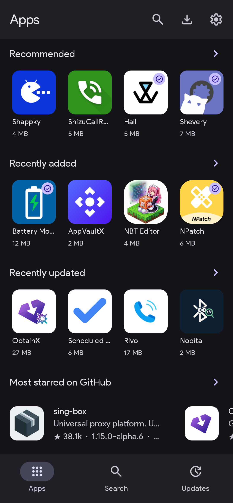
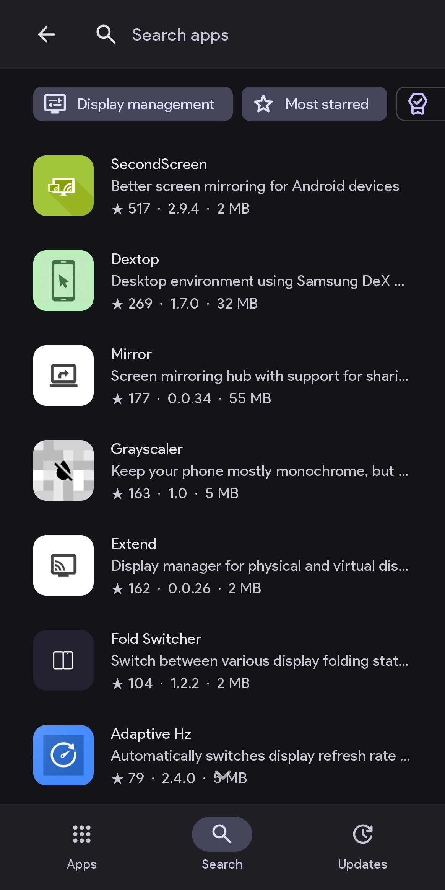
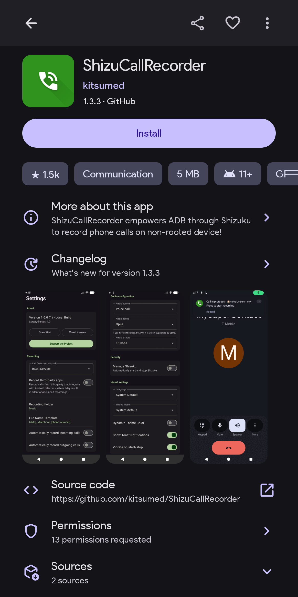
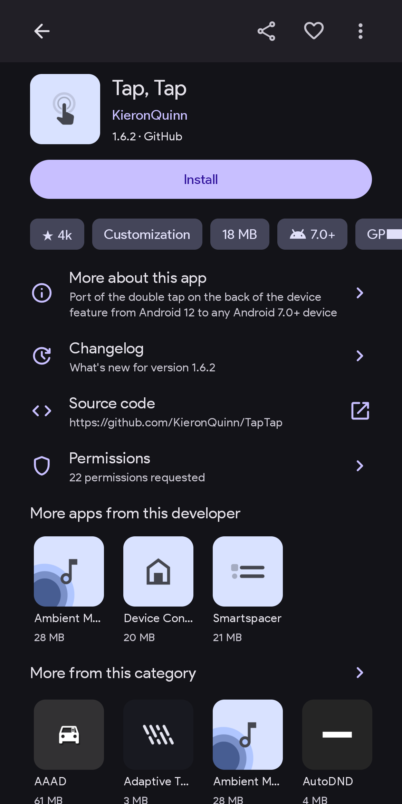

  

<h1 align="center">ShizuStore</h1>

**ShizuStore** is an app store for [Shizuku](https://shizuku.rikka.app/)
apps with automatic update support.

**APKs are downloaded directly from the official developers** via GitHub, GitLab, F-Droid, IzzyDroid, or other primary sources like Codeberg. APKs are not rehosted or redistributed by me.

### You can find APK downloads [in the release section](https://github.com/timschneeb/ShizuStore/releases/latest).

## Features

- Based on my curated [awesome-shizuku list](https://github.com/timschneeb/awesome-shizuku).
- Apps are organized by category and sortable by recently added, recently updated, most starred and most downloaded!
- Can silently install apps using Shizuku.
- Scheduled update checks every 6 hours to weekly, with optional automatic
  installs and Wi-Fi-only background activity.
- Shows app descriptions, GitHub/GitLab star counts, update changelogs, requested app permissions and screenshots (if available).

The [backend server](https://github.com/timschneeb/ShizuStoreServer) indexes the [awesome-shizuku list](https://github.com/timschneeb/awesome-shizuku) and collects metadata by analyzing repositories and APK files.

## Screenshots

  
  
  
  

## Downloads

You can find APKs in the release section: https://github.com/timschneeb/ShizuStore/releases/latest

## Publishing an app

Add the app to [awesome-shizuku list](https://github.com/timschneeb/awesome-shizuku); the app store will automatically pick it up from there. To get listed, follow the [contribution guide](https://github.com/timschneeb/awesome-shizuku/blob/master/CONTRIBUTING.md) or open an issue in the [awesome-shizuku](https://github.com/timschneeb/awesome-shizuku) repo.

How the store discovers your releases and displays your app is documented in the server's [listing and metadata documentation](https://github.com/timschneeb/ShizuStoreServer/blob/master/docs/listing-and-metadata.md).

## Translations

Do you want to help translate ShizuStore? You can help at [Crowdin](https://crowdin.com/project/shizustore)! Thank you!

<a href="https://crowdin.com/project/shizustore">
  <picture>
    <source media="(prefers-color-scheme: dark)" srcset="https://badges.crowdin.net/badge/light/crowdin-on-dark@2x.png" width="150px">
    <source media="(prefers-color-scheme: light)" srcset="https://badges.crowdin.net/badge/dark/crowdin-on-light@2x.png" width="150px">
    
  </picture>
</a>

<https://crowdin.com/project/shizustore>

## Credits

ShizuStore is based on [Aurora Droid](https://gitlab.com/AuroraOSS/auroradroid) developed by Aurora OSS, licensed under GPL-3.0-or-later. 
Individual files carry the attribution in their header.

### Libraries

[Jetpack Compose](https://developer.android.com/compose) ·
[Material 3](https://m3.material.io/) ·
[Navigation 3](https://developer.android.com/guide/navigation) ·
[Room](https://developer.android.com/training/data-storage/room) ·
[Hilt](https://dagger.dev/hilt/) ·
[WorkManager](https://developer.android.com/topic/libraries/architecture/workmanager) ·
[Paging 3](https://developer.android.com/topic/libraries/architecture/paging/v3-overview) ·
[DataStore](https://developer.android.com/topic/libraries/architecture/datastore) ·
[kotlinx.serialization](https://github.com/Kotlin/kotlinx.serialization) ·
[Coil](https://coil-kt.github.io/coil/) ·
[OkHttp](https://github.com/square/okhttp) ·
[libsu](https://github.com/topjohnwu/libsu) ·
[Shizuku](https://shizuku.rikka.app/) ·
[Refine](https://github.com/RikkaApps/Refine) ·
[HiddenApiBypass](https://github.com/LSPosed/AndroidHiddenApiBypass)

## License

GPL-3.0-or-later. See [LICENSE](LICENSE).
