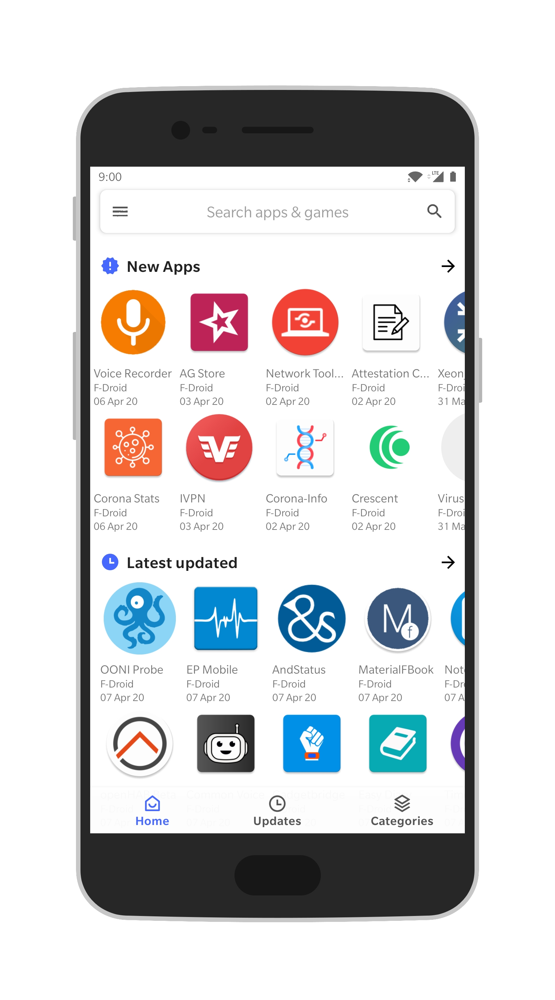
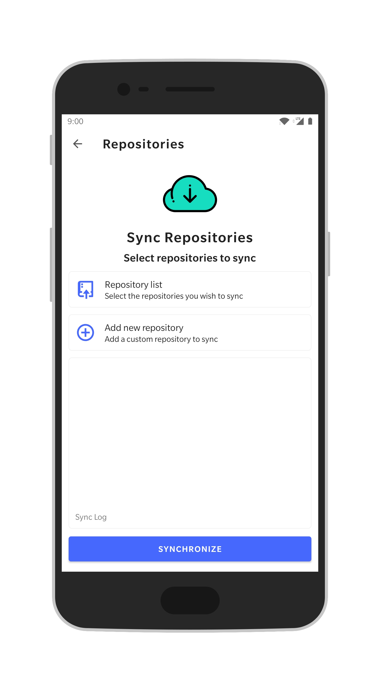
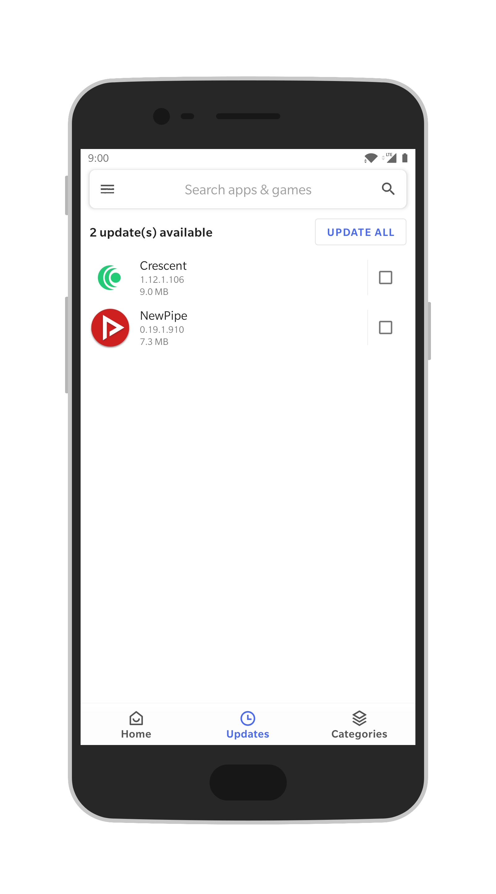
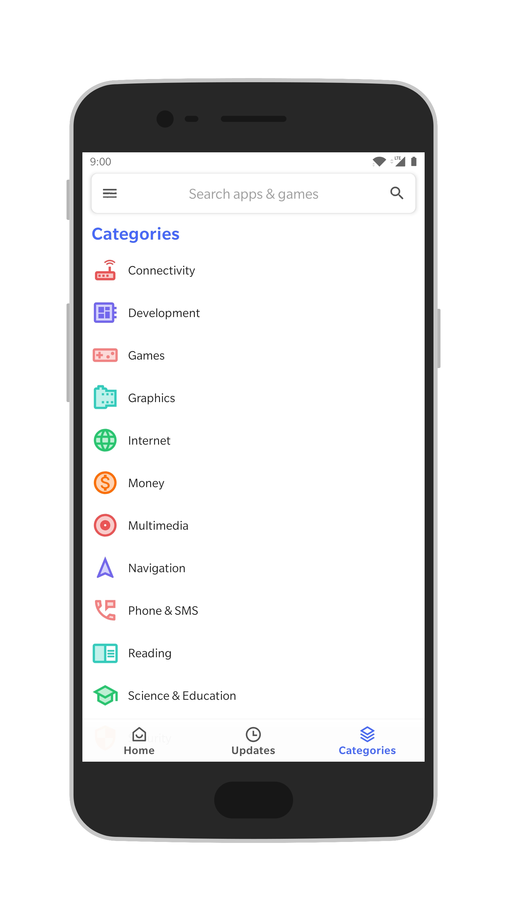
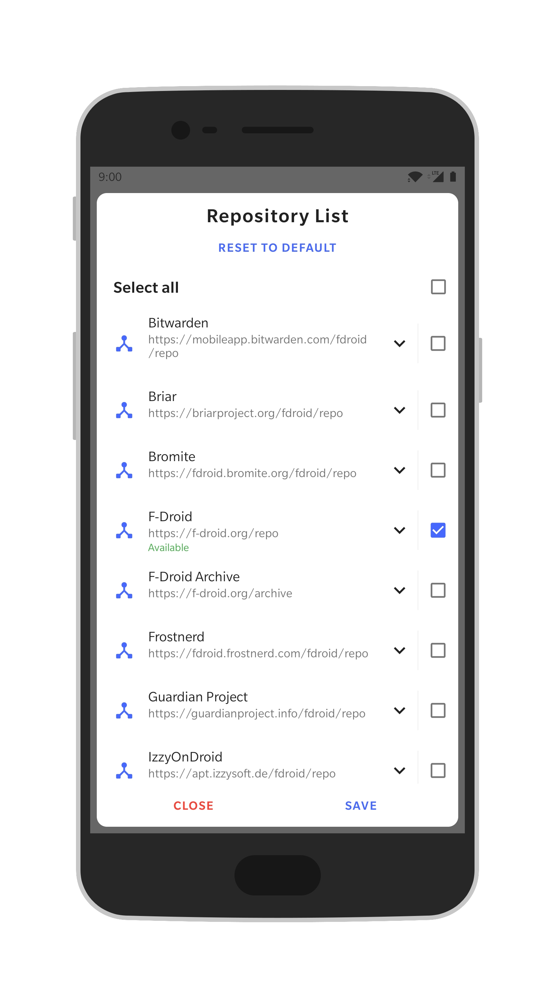
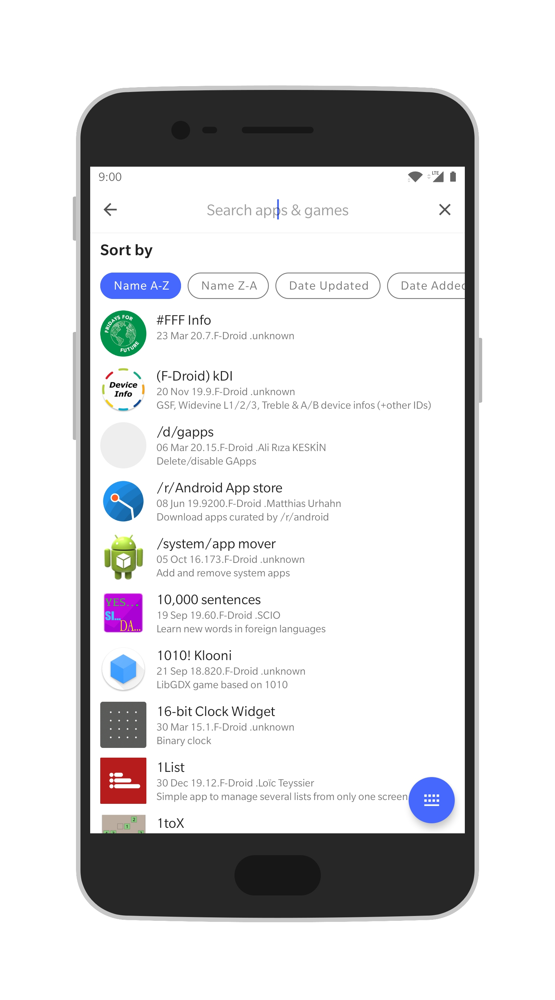

<br/>

# Shizu Store

> **Fork notice.** Shizu Store is a fork of
> [Aurora Droid](https://gitlab.com/AuroraOSS/auroradroid) (GPL-3.0-or-later,
> upstream HEAD `32385c8`). The F-Droid multi-repo index sync and repository
> management have been replaced by the `ShizuAppStoreServer` `/v1/*` REST API.
> The browse, search, details, download and installer flows, including the
> session, root and Shizuku installers, are inherited from Aurora Droid.

*Shizu Store* is a sideloaded store for [Shizuku](https://shizuku.rikka.app/)
apps. It indexes the awesome-shizuku list through the Shizu backend and installs
APKs from their upstream sources.

Shizu Store is not affiliated with Aurora OSS.

## Screenshots





## Features

**One catalogue.** Every app the backend serves lands in a single list, organised
by category, with recently added, recently updated, recommended and most starred
sections. Search covers all of them at once.

**Four install methods.** The default session installer, the system installer,
root, and Shizuku. Root and Shizuku install without a confirmation dialog for
each app.

**Scheduled update checks.** The catalogue is checked on an interval of your
choosing, from every 6 hours to weekly, or not at all. On devices that support
silent installs, updates can be downloaded and applied automatically. All
background activity can be restricted to Wi-Fi.

**Compatible updates only.** A candidate whose `minSdk` is above the device
release is not offered.

**A full download manager.** Progress, cancellation, retries and queue
management. APKs are downloaded from their upstream source; nothing is mirrored.

**Grouped notifications.** A batch of updates produces a single summary rather
than one notification per app.

**Favourites, blacklist and ignored updates.** Mark the apps you follow, hide
packages you never want to see, and skip a specific version of an individual app.

**No tracking.** No analytics, no accounts, no third-party services. Every APK is
verified against the checksum published by its source before installation, and
candidates are matched against the installed signing key, so a substituted server
cannot move a user between signing keys.

**Free software.** GPLv3, developed in the open, with no proprietary components
in the build.

## Requirements

| Requirement | Version |
|---|---|
| Android | 7.0 (API 24) and above |
| Target/compile SDK | 37 |
| JDK | 21 (the Gradle toolchain resolves it automatically) |
| Gradle | via `./gradlew`, AGP 9.x, Kotlin 2.4.x |

## Building

```bash
./gradlew assembleDebug
```

The APK lands in `app/build/outputs/apk/` as `ShizuStore-<version><-type><-unsigned>.apk`.

### Build types

| Type | Application ID | Notes |
|---|---|---|
| `debug` | `me.timschneeberger.shizustore.debug` | Signed with the tracked AOSP `testkey.jks`, so debug builds are interchangeable across machines |
| `release` | `me.timschneeberger.shizustore` | Minified and resource-shrunk |
| `nightly` | `me.timschneeberger.shizustore.nightly` | Release settings, version name suffixed with the short commit hash |

Release and nightly builds are signed only if a `signing.properties` exists in the project root;
without it they are produced unsigned and the file name says so. The file is gitignored and looks
like this:

```properties
STORE_FILE=/path/to/keystore.jks
STORE_PASSWORD=...
KEY_ALIAS=...
KEY_PASSWORD=...
```

### Checks

```bash
./gradlew ktlintCheck    # style, `ktlintFormat` to fix
./gradlew lintDebug      # Android lint, config in app/lint.xml
```

Room schemas are exported to `app/schemas/`; commit the new JSON whenever the database version
changes.

## Project layout

Everything lives in the single `:app` module, under `me.timschneeberger.shizustore`.

| Package | What is in it |
|---|---|
| `compose/ui/` | One package per screen (apps, app list, updates, details, downloads, settings, about, installed, favourites, blacklist, ignored) |
| `compose/composable/` | Shared widgets: list items, top bars, placeholders, shimmer, permission lists |
| `compose/navigation/` | `Screen` keys and the Navigation 3 `NavDisplay` |
| `compose/theme/` | Material 3 expressive theme, dynamic colour, light/dark |
| `viewmodel/` | One ViewModel per screen, Paging 3 where lists can grow |
| `data/api/` | Server DTOs, enums, the OkHttp client and the request throttle |
| `data/sync/` | Catalog sync engine: bootstrap, incrementals, DTO mapping |
| `data/network/` | OkHttp client, Coil image cache policy, proxy support |
| `data/download/` | APK hash verification and archive extraction |
| `data/installer/` | Session, native, root and Shizuku installers behind one `IInstaller` |
| `data/work/` | `SyncWorker`, `DownloadWorker`, `InstallWorker`, `UpdateWorker` |
| `data/room/` | Database, DAOs and entities (app, app_download, category, installed, download, favourite, blacklist, ignored, sync_state) |
| `data/repository/` | Query surface the ViewModels talk to |
| `data/helper/` | Sync, download and install orchestration, update batching |
| `data/receiver/` | Install status, package add/remove, download cancel and retry |
| `util/`, `extensions/` | Preferences (DataStore), notifications, paths, shortcuts, small Kotlin/Android extensions |

### How a sync works

1. `SyncWorker` runs the catalog sync on demand or from a scheduled `UpdateWorker` sweep.
2. With no stored cursor, `CatalogSyncer` bootstraps by paging `/v1/apps?sort=name&order=asc`
   until `total` is reached, then prunes slugs the server no longer has.
3. In steady state it applies `GET /v1/changes?since=<cursor>`: upserts added and updated
   summaries, deletes removed ones (with their candidates), and applies install-count deltas.
4. The category tree is refreshed when its ETag changes, and the cursor advances from
   `GET /v1/meta`.
5. `/v1/changes` carries summaries only, so `DetailedAppRepository` fetches `/v1/apps/{slug}`
   for install candidates and full descriptions when needed.

### How an install works

`DownloadHelper` stages a queue row from the chosen candidate. `DownloadWorker` fetches the
upstream `apkUrl`, verifies its SHA-256, and extracts the named member first when the release
ships the APK inside an archive. `InstallWorker` then hands the file to the selected installer.
Downloaded APKs are removed once the package manager confirms the install.

## How to

**Install without confirming every app.** Settings → App installer, then pick Root or Shizuku.
Session and System both go through Android's own confirmation dialog and cannot be silent.
Shizuku takes a little setup, covered [below](#setting-up-the-shizuku-installer).

**Turn on automatic updates.** Settings → Updates → Install updates automatically. It stays paused
unless background checks are on *and* the selected installer can install without confirmation, and
the screen tells you which of the two is missing.

**Change how often updates are checked.** Settings → Updates → Update checks: never, every 6 hours,
every 12 hours, daily or weekly. "Check on Wi-Fi only" makes background checks and automatic
downloads wait for an unmetered network.

**Use a proxy.** Settings → Network → Proxy, as `protocol://host:port` with an optional
`user:password@`. `http`, `https`, `socks` and `socks5` are supported, and it takes effect on the
next connection.

**Stop an app from nagging.** Open the app and ignore the update to skip that one version, or use
the blacklist to hide the package entirely. Both lists are under More.

**Point at another server.** Debug builds only: Settings → Server sets a base URL override. Release
builds use the baked `API_BASE_URL`.

## Setting up the Shizuku installer

[Shizuku](https://shizuku.rikka.app/) lends Shizu Store the system privileges it needs to install
apps without a confirmation dialog, on a device with no root. It is what makes fully automatic
updates possible on a stock phone.

You need Android 8.0 or later.

**1. Install and start Shizuku.**

Get it from [F-Droid](https://f-droid.org/packages/moe.shizuku.privileged.api/) or the
[project site](https://shizuku.rikka.app/), open it, and start the service by whichever route your
device allows:

* **Wireless debugging** (Android 11 and later, no computer needed) - turn on Developer options,
  enable Wireless debugging, and follow the pairing steps Shizuku walks you through.
* **ADB from a computer** - enable USB debugging, plug in, and run the command Shizuku shows you.
* **Root** - tap Start, grant superuser access, and you are done. If you are rooted, installing
  [Sui](https://github.com/RikkaApps/Sui) instead is smoother; Shizu Store treats it exactly like
  Shizuku.

Started over ADB or wireless debugging, Shizuku stops at every reboot and has to be started again.
Started with root or Sui, it comes back on its own.

**2. Point Shizu Store at it.**

Settings → App installer → Shizuku installer.

**3. Grant the permission.**

The first install asks Shizuku for access; allow it. If you miss the prompt, or something is off
later, the app tells you which piece is missing rather than failing quietly.

**4. Optional: let updates install themselves.**

With Shizuku working, Settings → Updates → Install updates automatically stops being greyed out.
Pair it with an update check interval and new versions download and install in the background.

If installs start failing, the usual cause is Shizuku having stopped after a reboot. Open it and
start the service again.

## Credits

Shizu Store reuses code from these projects, all GPL-3.0-or-later. Individual files carry the
attribution in their header.

* [Aurora Droid](https://gitlab.com/AuroraOSS/auroradroid) - the browse, search, details, download
  and installer flows this fork starts from.
* [Aurora Store](https://gitlab.com/AuroraOSS/AuroraStore) - installers (session, native, root,
  Shizuku), the download worker and download UI, notifications, navigation scaffolding, the
  settings screens and a number of shared composables.

### Libraries

[Jetpack Compose](https://developer.android.com/compose) ·
[Material 3](https://m3.material.io/) ·
[Navigation 3](https://developer.android.com/guide/navigation) ·
[Room](https://developer.android.com/training/data-storage/room) ·
[Hilt](https://dagger.dev/hilt/) ·
[WorkManager](https://developer.android.com/topic/libraries/architecture/workmanager) ·
[Paging 3](https://developer.android.com/topic/libraries/architecture/paging/v3-overview) ·
[DataStore](https://developer.android.com/topic/libraries/architecture/datastore) ·
[kotlinx.serialization](https://github.com/Kotlin/kotlinx.serialization) ·
[Coil](https://coil-kt.github.io/coil/) ·
[OkHttp](https://github.com/square/okhttp) ·
[libsu](https://github.com/topjohnwu/libsu) ·
[Shizuku](https://shizuku.rikka.app/) ·
[Refine](https://github.com/RikkaApps/Refine) ·
[HiddenApiBypass](https://github.com/LSPosed/AndroidHiddenApiBypass)

## License

GPL-3.0-or-later. See [LICENSE](LICENSE).
